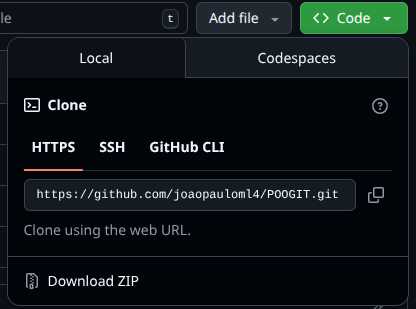

<h1>Clonando um repositório no Git</h1>

<p align = "justify">
Um repositório contém todos os seus códigos, arquivos e o histórico de revisão de cada arquivo, sendo esse um repositório no online, ele existirá como um repositório remoto, ou seja, ele só está disponível no site, para criar uma copia local em seu computador é possível clonar o repositório, <code>git clone<code>. A clonagem de um repositório baixa uma cópia completa de todos os dados dele que o site usado tem no momento, incluindo todas as versões de cada arquivo e pasta do projeto. É possível enviar suas alterações locais ao repositório remoto usando <code>git push</code>. Vamos iniciar falando dos conceitos de clonagem do repositório remoto.
</p>

<h2>Clone</h2>

<p align = "justify">
Usando o comando <code>git clone</code> servirá para <i>'copiar'</i> o repositório remoto para um repositório local. Para isso é necessário ir até esse repositorio remoto e copiar seu link, como mostra a imagem 1.
</p>

<p align = "left"><b>Figura 1</b> Representação de como clonar uma repositório usando o GITHUB.</p>
<center></center>

<p align = "justify">
Ficando deste jeito:
</p>

```bash
$ git clone https://github.com/joaopauloml4/POOGIT.git
```

<h2>Push</h2>

<p align="justify"> 


<p align = "justify">
O comando <code>git push</code> serve para enviar as modificações (já "commitadas") do repositório local para o repositório remoto.
<code>git push</code> usa dois argumentos: O nome do repositório remoto, por exemplo, <code>origin</code> e o nome da branch, por exemplo, <code>main</code>.
Para os nomes acima o comando ficaria:
</p>

```bash
$ git push origin main
```


<i>Nota: Lembre-se que antes de enviar, você deve salvar suas alterações no histórico do Git usando <code>git add</code> e <code>git commit</code>.</i>