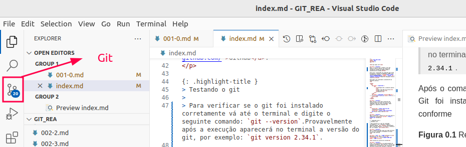

# 📚 Git e GitHub: Guia Completo para utilização em pesquisa

Este material foi cuidadosamente desenvolvido para oferecer uma compreensão sólida e prática das ferramentas essenciais de controle de versão e utilização em pesquisa.

## 👨‍🏫 Autores  

| Professor | Credencial | 
|-----------|------------| 
| **Wanderlei M. Pereira Junior** | [🔗 Lattes](http://lattes.cnpq.br/2268506213083114) |
| **Liliane do Nascimento Vale** | [🔗 Lattes](http://lattes.cnpq.br/6706645814872000) |
  
## 👨‍🏫 Organizadores  
  
| Discente | Credencial |  
|-----------|------------|  
| **Cauã Netto** | [🔗 Lattes](https://lattes.cnpq.br/5202229747836883) |  
| **Edilson Alves** | [🔗 Lattes](https://lattes.cnpq.br/4989973424640557) |  
| **Renata Pensim** | [🔗 Lattes](http://lattes.cnpq.br/1294978096445231) |  
  
## 🎯 Público-Alvo  
  
- 👨‍🎓 **Estudantes** de tecnologia e áreas correlatas  
- 👨‍🏫 **Professores** que desejam incorporar versionamento em suas disciplinas    
- 💼 **Profissionais** que buscam qualificação em ferramentas de desenvolvimento  
- 🔧 **Qualquer pessoa** interessada em aprender controle de versão  

## 📋 Coisas que você precisa instalar ou possuir conta  
- Instalar [Visual Studio Code](https://code.visualstudio.com/download)
- Instalar [Git](https://git-scm.com/install/windows)  
- Possuir uma conta no [GitHub](https://github.com/)

## Como usar  Git

Ao instalar o **Git** existirá diversas maneiras de efetuar o uso dessa ferramenta:
- A primeira é pelo próprio terminal do computador no caso do uso de Windows ou Linux;
- A segunda maneira é pelo terminal da própria ferramenta o **Git Bash** disponível na busca do Windows;  
- A terceira opção é fazer uso dentro do **VS Code** como mostra a Figura r.01. Sendo essa opção a mais utilizada por programadores.  
  

**Figura r.01** - Opção de uso do Git pelo VS Code.

> Em linhas gerais vamos aplicar as modificações via terminal para fixar o uso. Depois com a prática os usuários poderão utilizar os botões que aplicam as modificações, e configurações.

## 📋 [Acesse o conteúdo](https://github.com/wmpjrufg/rea_github/blob/main/README.md)  
